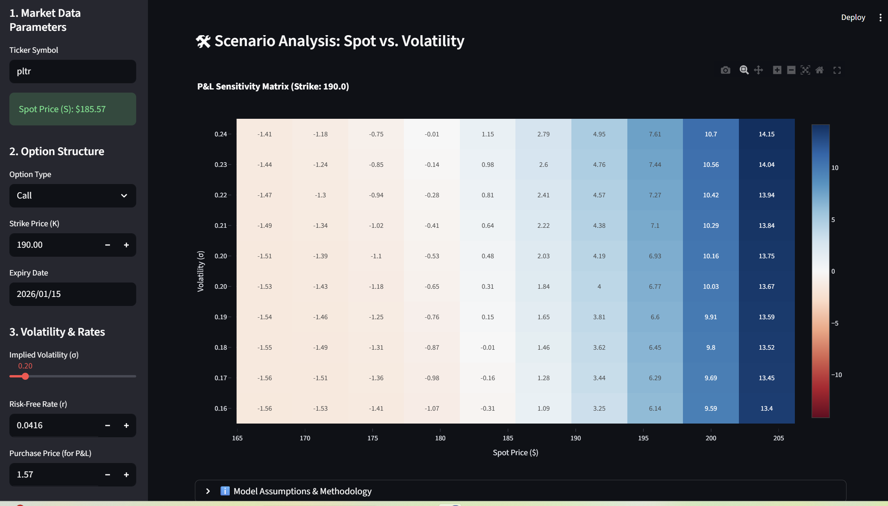

# 📊 Real-Time Options Pricing Tool

### **Live Demo:** [Click Here to Launch App](LINK_TO_YOUR_STREAMLIT_APP_HERE)

## 💡 Overview
This is a front-office style derivative pricing engine built with **Python** and **Streamlit**. It allows traders and risk managers to visualize option prices and risk metrics ("Greeks") in real-time using live market data.

## 🚀 Key Features
* **Real-Time Data Feeds:** Fetches live Equity Spot prices and 10-Year Treasury Yields via `yfinance`.
* **Black-Scholes-Merton Engine:** Custom Python implementation of the BSM closed-form solution.
* **Dynamic Greeks:** Real-time calculation of Delta, Gamma, Vega, Theta, and Rho.
* **Interactive Heatmaps:** 3D visualization of P&L scenarios to identify volatility traps.

## 🛠️ Tech Stack
* **Core Logic:** Python (NumPy, SciPy)
* **Frontend:** Streamlit
* **Visualization:** Plotly
* **Data:** Yahoo Finance API

## ⚠️ Disclaimer
**For Educational Purposes Only.** This model should not be used for actual financial trading.

---
**Created by:** Ori Divon